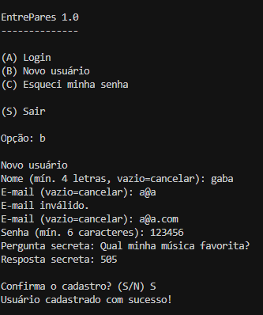
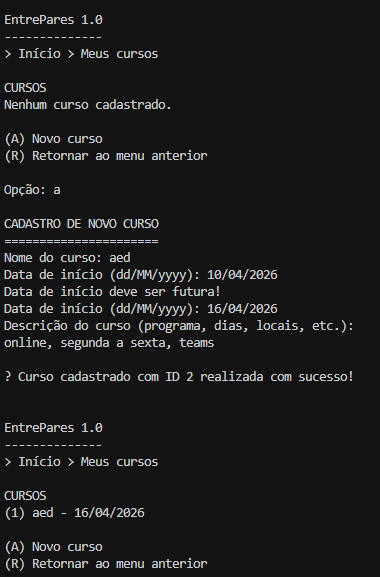
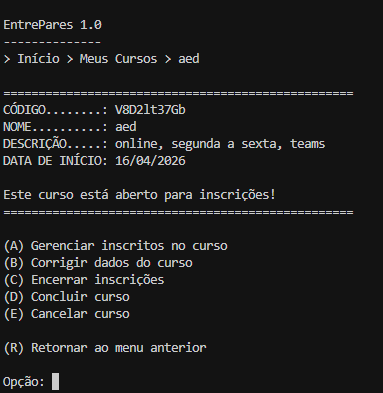
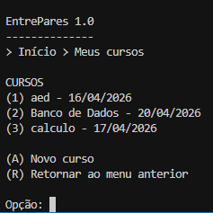
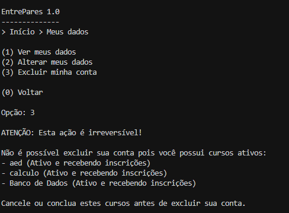
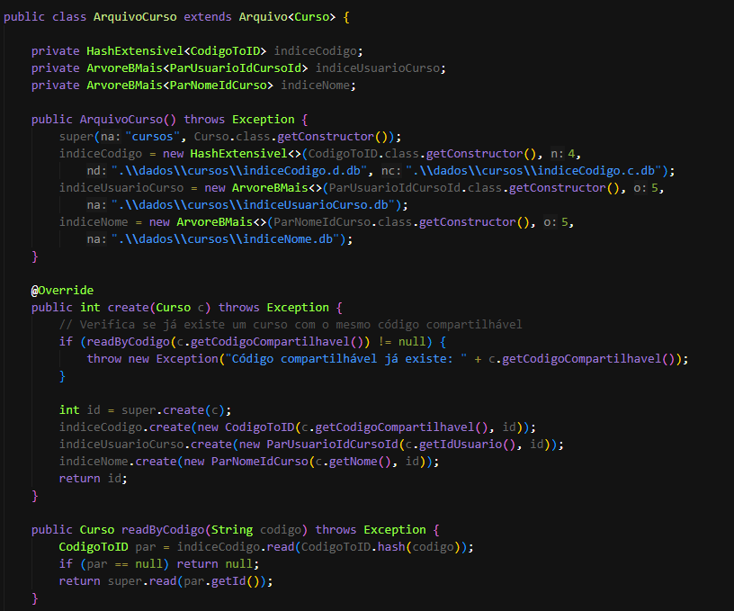
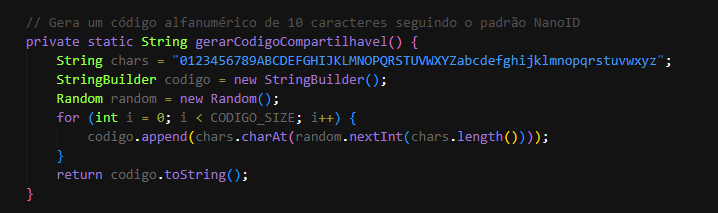
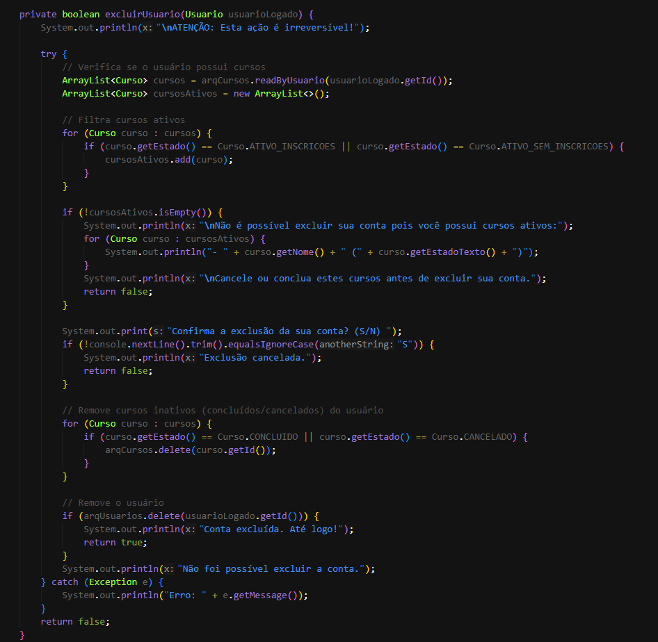

AEDs III - TP01
Participantes: Pedro Henrique Cardoso Maia, Gabriel Egídio Santos Beloni, Gabriel Evangelista Massara, Thiago Aurélio Nunes Martins

Descrição do TP:

Oque o Sistema faz?
    
O EntrePares 1.0, armazena os dadps e registros em arquivos .db de maneira randômica usando o RandomAcessFile. Além disso, o sistema reaproveita os espaços de registros excluídos através do uso de lápide e encadeamento. O mesmo usa também Tabelas Hash para as buscas diretas (Id, email, código do curso) e as árvores B+ para os indíces indiretos.

    Classes do Trabalho

        /entidades
    Usuario.java - Define o modelo de dados do usuario, incluindo os atributos sejam eles email, nome a hash para a senha e a pergunta de segurança. Usa-se toByteArray() e fromByteArray() para a serialização e desserialização do objeto para o banco de dados.
    Curso.java - Define a entidade curso contendo a chave idUsuario quie estabelece o relacionamento com o criador. E gera o código padrão NanoID.

        /arquivo
    ArquivoUsuario.java - CRUD para a entidade Usuario, além de gerenciar o indice indireto baseado na Tabela Hash (EmailToID) oque garante unicidade.
    ArquivoCurso.java - CRUD para a entidade Curso, que gerencia um Hash e duas árvores B+ (uma por idUsuario e a outra para ordenar de maneira alfabética por nome)
    EmailToID.java - Define a estrutura entre o email e o id do usuario, oque permite o login e garante que o email é único pela Tabela Hash
    CodigoToID.java - Define a ligação entre NanoID e o seu id, permitindo a verificação de unicidade.

        /auxiliares
    Arquivo.java - Implementa o gestor de CRUD, o qual é a base do sistema. O mesmo gerencia o acesso ao .db, o controle de registros ao quais foram excluidos (marcados pela lápide), e indice direto (ID)
    ParUsuarioIdCursoId.java - Define a estrutura de nó da árvore B+
    ParIDEndereco.java - Define o par básico de indexação direta
    ParNomeIdCurso.java- Define a estrutura de nó da árvore B+
    OBS: Usamos as classes fornecidas e apresentadas em sala, as quais foram integradas no projeto e se encontram em auxiliares, como a HashExtensivel.java, ArvoreBMais.java, RegistroHashExtensivel.java e InterfaceArvoreBMais.java.

        /visao
    MenuUsarios.java - Responsável pelo login e gerenciamento de conta, além de aplicar a verificação de integridade que impede o delete da conta caso o usuário tenha algum curso ativo no momento da tentativa de exclusão
    ControleCurso.java - Tal classe é a responsável pela lógica de navegação e as operações entre os cursos (criar, mudar, encerrar e mais opções)
    VisaoCurso.java - Centraliza as funções de entrada e saída de cursos para o usuario.

Prints do projeto:
    Interface/Execução

1-

*Cadastro de um novo usuário do sistema*

2-

*Criação de um novo curso no sistema*

3-

*Interface de dados sobre o curso cadastrado no sistema*

4-

*Vários cursos cadastrados, os quais são ordenados pela árvore B+ de maneira alfabética*

5-

*Tentativa de deletar a conta com cursos ativos, o qual o sistema não permite*

Código
    (Operações Especiais Implementadas)
1-

*Usa-se a classe ParUsuarioIdCursoId como chave de uma árvore dentro da classe ArquivoCurso. Permitindo que o sistema consiga os cursos de um usuario específico sem ter que ler o arquivo inteiro*

2-

*Tal operação garante que dois cursos nunca tenham o mesmo código (são únicos), tal garantia é feita através da verificação da tabela Hash para ver se o código já existe, caso true, cancela.*
        
3-

*Tal especialidade verifica se há cursos com '0' ou '1', caso tenha, o sistema não permite a exclusão da conta, visto que é uma regra do sistema, caso o usuário tenha apenas cursos inativos, os sistema realiza a exclusão em cascata*

    CheckList:
    1- Há um CRUD de usuários (que estende a classe ArquivoIndexado, acrescentando Tabelas Hash Extensíveis e Árvores B+ como índices diretos e indiretos conforme necessidade) que funciona corretamente? Sim. A classe ArquivoUsuario estende a base do CRUD e tem a tabela hash implemntada para busca por email.
    2- Há um CRUD de cursos (que estende a classe ArquivoIndexado, acrescentando Tabelas Hash Extensíveis e Árvores B+ como índices diretos e indiretos conforme necessidade) que funciona corretamente? Sim. A Classe ArquivoCurso faz a instancia e o uso do arquivo e os métodos de Crud os quais tão ligados a Curso
    3- Os cursos estão vinculados aos usuários usando o idUsuario como chave estrangeira? Sim. Curso possui idUsuário, o qual é lido e gravado por toByteArray e o relacionamento é estabelecido na criação do metodo leCurso
    4- Há uma árvore B+ que registre o relacionamento 1:N entre usuários e cursos? Sim. Foi implementada em ParUsuarioIdCursoId usando a InterfaceArvoreBMais
    5- Há um CRUD de usuários (que estende a classe ArquivoIndexado, acrescentando Tabelas Hash Extensíveis e Árvores B+ como índices diretos e indiretos conforme necessidade)? Sim. A classe ArquivoUsuario estende a base do CRUD e tem a tabela hash implemntada para busca por email. (Pergunta repetida na 1)
    6- O trabalho compila corretamente? Sim. O código e a estrutura dos arquivos está coerente com a linguagem Java e é compilado sem erros.
    7- O trabalho está completo e funcionando sem erros de execução? Sim. Foram implementadas todas as funcionalidades solicitadas.
    8- O trabalho é original e não a cópia de um trabalho de outro grupo? Sim.

Vídeo de Demonstração: https://youtu.be/Zv_o0GNqIkE

Comandos de Compilação:

javac -cp .;aed3/ -d out/ src/**/*.java src/Main.java

java  -cp out/;aed3/ Main

